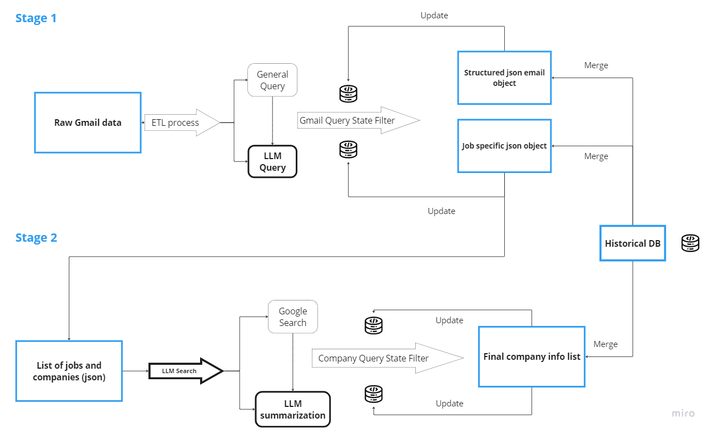

# Gmail Job Assistant LLM

## Overview

This repository contains a Large Language Model (LLM) assistant powered by GPT-4o-mini, designed to help job seekers organize their Gmail data, particularly for job alerts from platforms like LinkedIn, Indeed, Untapped, and others. This tool uses the Langchain framework and offers a cost-effective solution, processing over 2000 emails for less than $6.

## Installation


1. Configure the repository as editable:
   ```
   pip install -e .
   ```

2. Set up your .env variables:
   ```
   OPENAI_API_KEY=your_openai_api_key
   gmail_credentials=/path/to/your/credentials.json
   gmail_token=/path/to/your/gmail_token.pickle
   gmail_address=yourgmailaddress@gmail.com
   GOOGLE_API_KEY=your_google_api_key
   GOOGLE_CSE_ID=your_google_cse_id
   QUERY_GMAIL_STATE=db/gmail_query_state.json
   QUERY_COMPANY_STATE=db/company_query_state.json
   ALL_EMAILS=db/job/gmail_data/all_emails.json
   JOB_LIST=db/job/job_list_all.json
   JOB_LIST_FINAL=db/job/jobs_merge.json
   CACHE=gmail_assistant_llm/cache
   ```


## How It Works

1. **Email Scraping**: Retrieves emails from your Gmail account based on specified labels.
2. **ETL Process**: 
   - Extracts structured JSON data from raw email objects
   - LLM assists in parsing position information, company names, dates, etc.
3. **Company Research**: 
   - LLM searches the web for additional company details
   - Gathers info on founding year, IPO status, funding, industry, etc.
4. **Data Integration**: Automatically merges new data with historical database

This process helps job seekers prioritize applications based on their interests and company profiles, saving time on manual research. 😅 It can be also very helpful to find interesting startup. There are general two stages of processing:

Stage 1: Raw Gmail data undergoes an ETL process, where LLM queries extract and structure email information into JSON objects. These objects are filtered and updated, then merged into a Historical Database.

Stage 2: A list of jobs and companies is further enriched through LLM-assisted Google searches. The filtered and summarized company data is updated and merged into the final company info list and Historical Database, ensuring comprehensive and updated job and company information. It's simply summarized in below diagram:



## Usage

1. Configure `config.yaml`:
   - Set `initialize` to `False` for continuous updating

2. Run the pipeline:
   ```bash
   cd gmail_assistant_llm
   Python gmail_activate.py
   python gmail_assistant_pipeline.py

You need to activate your gmail API credentials before running the LLM pipeline

## Analysis Options

- Simple: Export to Excel (recommended for structured visualization)
- Programming way: Analyze using pandas
- Luxurious: Develop an agent or LLM Q&A chatbot (for more advanced interactions)

For Excel export, refer to:
`gmail_assistant_llm/post_analytics/analyze_jobs.ipynb`


---

Feel free to contribute or report issues!